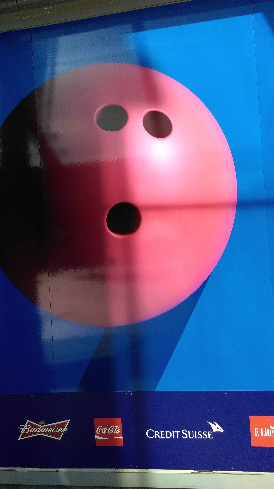

# EyeBombing

*Eyebombing* is the project presented today on the first day of [Fundamentals of Web Design course](https://github.com/RavensbourneWebMedia/Web-Design-principles/tree/2015/projects/eye-bombing). 
It consists on finding faces in daily common objects, using visual perception skills to improve the way we see the things as designers.

This project is already been published by **Jody Smith** in his [site](http://facesinplaces.blogspot.co.uk/), which I personally found really influential to understand the deeper meaning of looking from the designer perspective, not only analysing shapes, colours, light..., but giving it a meaning and a context.

So to put this on practice, we had a walk around the building area, trying to find faces in the objects around, and for my surprise, it was not as hard as it seemed to be to find really good spots to shoot and find a smiley face, either in a tree, the wall, floor, clouds (not that easy), cars and a long etc.

So to give a nice use to some out of the bunch of pics we got, I decided to make some editing in order to get a bit more of it's faceyness, after tutor recommendations, and this is the result:

  
 
 
 
 
 
 
 
Really nice and fun project to take, besides the fact of learning to look and understand from a different new perspective.
 